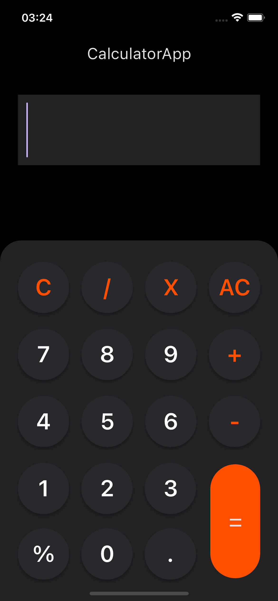

# calculatorapp

Bu Flutter uygulaması, provider kullanılarak tasarlanmış bir hesap makinesidir.

## Ekran Görüntüleri

    

## Kullanılan teknolojiler

Flutter: UI geliştirmek için kullanılan çerçeve.
Provider: Uygulama içindeki veri akışını yönetmek için kullanılan bir state yönetim desenidir.
function_tree: matematiksel ifadeleri işlemek ve analiz etmek için kullanılan bir Dart paketidir. Bu paket, matematiksel ifadeleri ağaç yapısında temsil eder ve bu yapı üzerinde çeşitli matematiksel işlemler gerçekleştirmenize olanak tanır.